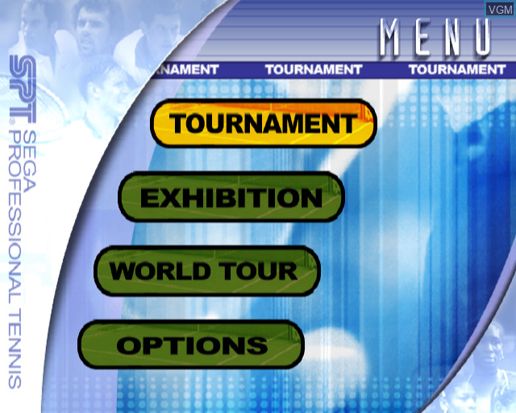

## HIPERCOGHLAN - WEB

UNA PAGINA WEB QUE HOSTEA **PIEZA/S DE CODIGO INTERACTIVO** QUE FUNCIONAN CONTRA DISTINTOS INPUTS  

UNA POR CANCION 
vs. 
MENOS PIEZAS EN ESQUEMA WEBPLAYER, QUE PUEDEN REPRODUCIR TODOS LOS TEMAS 
vs.
UNA SOLA PIEZA PARA UN SOLO TEMA?

ES___ UNA ESPECIE DE WEB PLAYER  

--- 

> SOUNDREACTIVE: parametros sincronizados en varios aspectos con distintos valores de la cancion que este sonando  
USER INPUT: parametros dinamizables por user input (sliders, number inputs, sound, video)  
DATA INPUT: parametros reactivos a lectura de datos en vivo (scraping, localdatabase, api calls)  

> SCRAPING: una idea central de todo esto es armar un mini script que lleve cuenta de todos los partidos de tenis sucediendo en vivo, y contar de esta manera con datos dinamicos para parametrizar algunas de las piezas

1.  estética y menú de selección de players línea VIRTUA TENNIS 2 - assets tipo psone (ENDLESS) de coghlan como jugador de tenis en varios arquetipos de la epoca (t. haas, el viejo de lars ulrich, agassi bald, todo eso) FIGMA / PHOTOSHOP / ILLUSTRATOR. cada player lleva a una PIEZA nueva (cantidad ideal, je. puede no ser una por cancion, esto puede ser para un single o algo asi)  

	
	
	
	
- LINKS
	- VIRTUA TENNIS 2 https://www.youtube.com/watch?v=ur340iaWkDQ 
	- ENDLESS <https://endless.io>
	

2.	cada PIEZA es una webpage interactiva que contiene un SISTEMA GRAFICO muy barebones. la idea es que estos sistemas interactuen NO SOLO con el track que tienen asignado, sino que tambien puedan responder a otros inputs ( SOUNDREACTIVE,  USER INPUT, DATA INPUT )
	
	IDEAS PARA POSIBLES PIEZAS / REFERENCIAS
	 - un hiperco enorme que sigue el mouse con la mirada, re tranqui
     - [FILTRO ASCII](https://editor.p5js.org/gingko/sketches/1uiyuOg2U) 
	 - (PHOTOBOX se puede scrappear para esto (txt), y tambien cambiar la paleta para usar la de HC) 
	 - [MODELO DE ISLING](https://editor.p5js.org/Nostrada/sketches/VeeLQwLgX)
	 	- re apto para recibir data live, es lindo, bello
	 - DRAGGABLE TENNIS BALL tipo vieja app de iphone
	 	- tipo stress relief
	 - HEATMAP SYNC TO MUSIC DE CANCHA DE TENIS
	 	- auroras boreales pero en una cancha de tenis
	 - MI FOTO CON "CO" 
	 	- meet and greet virtual con diversos CO y un banner de torneo de hipercoghlan
	 - GENERADOR DE [VISUALIZADORES WINDOWS MEDIA PLAYER](https://www.youtube.com/watch?v=H0d6tSqyN1Y)/[WINAMP](https://www.youtube.com/watch?v=9TbLJI7ja4s&t=5624s)
	 	- me hace pensar un poco en videos de miranda tipo bailarina
	 - [la grilla hot sauce](https://editor.p5js.org/gingko/sketches/idr-ysNcr) 
	 	- quizas con algun overlay de CO (sigue linea el ultimo baile) 
	 - espectrografo por barras con imagenes hipercoghlan
	 	- mascaras simples sobre los assets
	 - PONG rework

	 - slide puzzle con fotos de CO
	 
	 REFES  
	 - [disphing](https://disphing.com/href)
	 - esa pagina de saramalacara que tenia los overlays
	 	- esta x lo estructural principalmente, encare mas de landing page... no calza pero puede calzar
	 - algo del barroquismo de mtv 2milero de [ezramiller](https://ezramiller.biz/)  
	 	- tiene sonidillos
		- y muchas cosas interactivas

 

